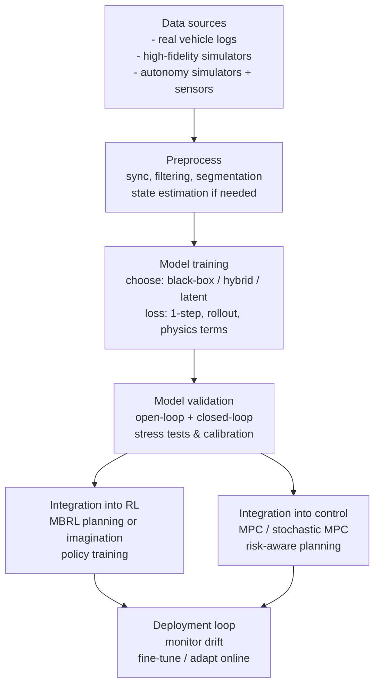
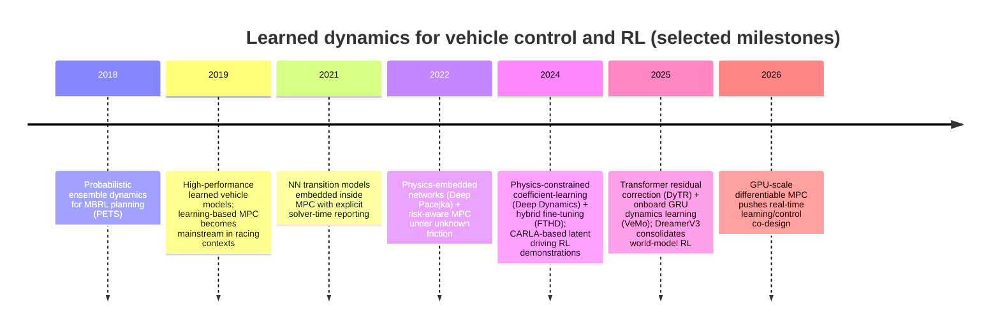

# Learned Neural Dynamics Models for Ground Vehicles in Reinforcement Learning and Control

## Executive Summary

Learned neural-network vehicle dynamics models sit between two competing needs: (i) *fidelity* (capturing tire saturation, coupling between longitudinal and lateral motion, and rapidly changing friction), and (ii) *computational tractability* (supporting real-time prediction inside MPC planners, or generating millions of transitions for reinforcement learning). Recent work shows a clear trend toward **hybrid and physics-guided models**—models that learn hard-to-identify parameters (tire/drivetrain coefficients, residual dynamics, latent forces) while retaining a structured physics backbone—because they improve generalization under distribution shift and enforce physical plausibility compared with purely black-box regressors. citeturn16view0turn25view0turn19view1

Across the last ~8 years of primary academic literature, three “families” dominate applications intended for later RL training or control: **(a) black-box state-transition NNs** trained on histories of states/inputs (often MLP/GRU), **(b) hybrid/gray-box networks** that embed bicycle + tire models (e.g., “Deep Pacejka” style) or constrain internal parameters to physical ranges (“physics guard”), and **(c) latent “world models”** that learn dynamics in a compact latent space for imagination/planning and RL, increasingly demonstrated in driving simulators. citeturn25view0turn16view0turn7search2turn0search34

Best practices that repeatedly appear—either explicitly in the papers or as a clear implication of their evaluation setups—include: **multi-step/closed-loop validation** (not just one-step prediction), **uncertainty handling** when models are used inside planning, and **compute-aware design** (small models, residual formulation, or GPU-accelerated differentiable control). Representative work reports solver runtimes on the order of tens of milliseconds for MPC-like loops and emphasizes structural choices that keep inference fast enough for embedded deployment. citeturn14view4turn4academia40turn3view1turn2search27

Simulation infrastructure remains central for both data generation and evaluation. Commercial high-fidelity vehicle dynamics tools (e.g., CarSim and CarMaker) are routinely used for co-simulation, calibration, and scenario generation, while open simulators like CARLA and Gazebo are common for RL training and sensor-loop prototyping. CarSim is explicitly positioned as *high-fidelity multi-body vehicle dynamics* simulation software, and CARLA provides a simulator with modular sensors and a programmable API commonly used in autonomous driving research. citeturn3view4turn3view5turn1search1turn1search2turn1search14

## Problem scope and use cases

### What “vehicle dynamics” means in this report

Most learned dynamics models for ground vehicles in RL/control approximate a discrete-time transition (or residual transition) of the form:

- **State-transition form:**  \(\;x_{t+1} = f_\theta(x_t, u_t, p_t)\;\)  
- **Residual form:**  \(\;x_{t+1} = f_{\text{phys}}(x_t, u_t, \hat p_t) + r_\theta(\cdot)\;\)

where \(x_t\) typically includes longitudinal velocity \(v_x\), lateral velocity \(v_y\), yaw rate \(\omega\), pose \((x,y,\theta)\), and actuator states; \(u_t\) includes steering and throttle/brake (or their increments); and \(p_t\) bundles parameters such as friction \(\mu\), tire states, drivetrain coefficients, mass distribution, etc. Physics-embedded neural networks and physics-constrained networks explicitly enforce this split by embedding bicycle + tire equations inside the network or by constraining internal learned coefficients. citeturn25view0turn16view0turn19view2

### Simulation for RL data generation

When the goal is RL training (especially off-policy RL), learned dynamics models are used as **fast simulators** to generate many transitions cheaply once trained. Model-based RL methods often roll out learned models repeatedly inside planning or policy improvement, making inference cost and stability over rollouts central. citeturn7search0turn7search1turn7search2

In practice, two simulator “tiers” often coexist:

- **High-fidelity dynamics simulators** for generating ground-truth trajectories (or for validation): CarSim (multi-body, high-fidelity vehicle dynamics) and CarMaker (toolchain and virtual test driving workflows) are widely used commercial options. citeturn3view4turn3view5  
- **Closed-loop autonomy simulators** for sensor + planning stacks: CARLA provides modular sensors (e.g., cameras, LiDAR, GNSS, IMU) and a programmable interface, supporting RL setups that include partial observability and perception noise. citeturn1search1turn1search2turn1search14  

### Model-based RL and planning with learned dynamics

Model-based RL (MBRL) uses learned dynamics to plan actions (trajectory optimization) or to generate synthetic rollouts for policy learning. Canonical methods include probabilistic ensemble dynamics for planning (PETS) and approaches that blend short model rollouts with model-free updates (MBPO). citeturn7search0turn7search1  
Latent world-model approaches (Dreamer-family) learn a latent transition model and train policies “in imagination,” motivating latent dynamics as a relevant class even when the model’s inputs are observations rather than physical state. citeturn7search2turn7search19

### MPC and optimal control with learned models

A primary control use case is **MPC with a learned prediction model**, where the NN replaces (or augments) the bicycle model. For example:

- A data-driven NN was trained to represent vehicle transition dynamics from *state/input histories* and then used inside MPC for lateral control, with explicit reporting of dataset size and MPC solve-time distributions. citeturn14view2turn14view4  
- Physics-embedded networks (Deep Pacejka style) incorporate the Pacejka tire model and bicycle dynamics as differentiable layers and then use learned latent tire forces for risk-aware MPC under unknown friction. citeturn25view0  
- Physics-constrained networks (Deep Dynamics) estimate physically meaningful coefficients and constrain them to nominal ranges while evaluating both open-loop and closed-loop performance (including on full-scale autonomous racing data). citeturn16view0turn15view1  

### Online adaptation and system identification

Online adaptation is used when friction, tire wear, payload, or drivetrain responses drift over time. Two representative patterns appear:

- **Online learning / adaptive NN updates:** A “no prior data required” adaptive neural approach can initialize online and improve once enough data is collected; the paper explicitly notes the adaptation iterations needed before it can outperform a conventional nonlinear model. citeturn14view4  
- **Physics-informed online parameter estimation:** Physics-informed deep learning has been proposed to rapidly estimate cornering stiffness using smaller datasets that can be elicited from maneuvers such as lane-change/overtake, explicitly motivated by stability control needs. citeturn18academia41  

## Model families and neural architectures

### Model types used for ground vehicle dynamics

**Black-box NNs (purely data-driven).**  
These learn state transitions directly from measured states/inputs (often with history windows). A feedforward baseline with residual-state prediction trained from historical state-action pairs is one canonical pattern. citeturn25view0turn14view2

**Physics-embedded / physics-informed models.**  
Two closely related approaches dominate:

- **Physics embedded layers (Deep Pacejka model):** a network predicts parameters of the Pacejka formula and a longitudinal force term, then propagates through the Pacejka layer and bicycle model layer to generate state derivatives and residual state changes. citeturn25view0turn21view0  
- **Physics-constrained coefficient estimation (Deep Dynamics):** the network estimates unknown coefficients (tire/drivetrain/moment of inertia) and uses a “Physics Guard” mechanism to keep them within nominal ranges; the estimated coefficients are then inserted into the vehicle equations. citeturn16view0turn15view1  

**Structured / gray-box and residual hybrids.**  
Residual learning corrects a baseline physics model rather than learning the full mapping, and recent work proposes Transformer-based residual correction for high-fidelity dynamics. citeturn17search9turn6search2

**Probabilistic / uncertainty-aware dynamics.**  
Uncertainty-awareness is critical when planning with a learned model: probabilistic ensembles are a standard mechanism in MBRL (e.g., PETS), and deep ensembles are widely used for predictive uncertainty in deep learning more broadly. citeturn7search0turn8search2

**Latent dynamics and world models.**  
Latent dynamics models learn a compact “belief state” transition and are used for planning/RL via imagination (Dreamer-family). In driving-focused demonstrations, latent world models have been explored in CARLA-based setups for autonomous driving RL. citeturn7search2turn0search34

### Common NN architectures in the vehicle-dynamics literature

image_group{"layout":"carousel","aspect_ratio":"16:9","query":["dynamic bicycle model diagram vehicle dynamics","Pacejka magic formula curve lateral force vs slip angle","CarSim vehicle dynamics simulation screenshot","CARLA simulator urban driving screenshot"],"num_per_query":1}

**MLP / fully connected networks.**  
Still the default when the model is state-based and sampling rates are high. Deep Pacejka’s baseline FF-NN uses multiple fully connected layers and predicts residual state changes. citeturn25view0

**RNN/GRU/LSTM.**  
Recurrent architectures are used to capture hidden variables (e.g., gear shifting, friction variation) and memory effects. Recent autonomous racing oriented modeling includes GRU encoder-decoder approaches that explicitly predict onboard vehicle states, reporting low mean errors (e.g., <2.6% and <1.2% in one representative system). citeturn0search33  
The NN-in-MPC path tracking paper trains a multilayer NN on history of vehicle states and steering-wheel input; the history itself serves as a simple “memory” surrogate even when the network is not explicitly recurrent. citeturn14view2

**Transformers for dynamics residuals and spatiotemporal modeling.**  
A Transformer-based residual correction network (“DyTR”) is proposed to correct physical-model residuals, with reported large reductions in prediction error. citeturn6search2turn22search27

**Convolutional nets for observation-level (“perception-to-control”) dynamics.**  
In end-to-end autonomy stacks, CNNs (and sometimes CNN-RNN hybrids) map image-like observations to actions or intermediate trajectories, often trained via imitation. While not “vehicle dynamics” in the strict physics sense, they are relevant when the learned model is used as a closed-loop policy surrogate in simulation frameworks built for racing or driving testbeds. citeturn22search2turn22search21

**Graph neural nets and structured spatial models.**  
In vehicle-only dynamics modeling, GNNs are less common than in multi-agent traffic interaction modeling; when present, they usually model interactions (road graph, other agents) rather than tire-force dynamics. (This detail is often not explicitly specified in the vehicle-dynamics-specific papers surveyed here.)

## Representations, data pipelines, and training objectives

### Input and output representations

A recurring design decision is whether the learned model operates on:

**State-space inputs (common in control).**  
Examples include:

- Dynamic bicycle state \( [v_x, v_y, \omega]\) plus pose \([x,y,\theta]\), with steering and a speed command; Deep Pacejka also uses *history windows* of state-action pairs. citeturn25view0  
- Full trajectory data with vehicle state history + steering input for MPC prediction. citeturn14view2  

**Observation-space inputs (common in RL/world models).**  
CARLA supports sensors such as cameras, IMU, and GNSS; this enables models trained on partially observed signals rather than full physical state, motivating latent-state approaches. citeturn1search2turn1search14

**Augmented parameters and latent variables.**  
Physics-embedded models often *implicitly* estimate tire forces and/or Pacejka parameters, treating them as internal latents and using them for risk-aware control. citeturn25view0turn16view0

### Training data sources and generation

**Real vehicle logs.**  
“Recorded vehicle data” under both high- and low-grip conditions is explicitly used to compare NN models against physics baselines in autonomous racing contexts. citeturn23search2turn15view1

**High-fidelity simulators and co-simulation.**  
Commercial simulators provide ground-truth-like state trajectories for training and closed-loop controller evaluation:

- CarSim is presented as high-fidelity vehicle dynamics simulation software for cars and trucks. citeturn3view4  
- CarMaker is described as a virtual test-drive tool chain for vehicle development. citeturn3view5  
- CARLA documents a programmable simulator interface and a broad sensor suite for autonomy research, supporting learning pipelines that include sensor noise and observation-driven control. citeturn1search1turn1search2turn1search14  

**Hybrid simulator setups.**  
CARLA has explicitly supported CarSim integration in a public release, reflecting a common practice of pairing a higher-fidelity dynamics engine with a sensor-rich autonomy simulator. citeturn1search22

**System identification experiments and excitation.**  
In practice, datasets are frequently built from *deliberately exciting maneuvers* that sweep across steering and acceleration regimes (e.g., zig-zag, high-speed cornering, sliding); the Deep Pacejka paper explicitly describes collecting training data across multiple maneuver types and multiple friction surfaces. citeturn25view0  
Because exact excitation protocols are often platform-specific, many papers do not fully specify them beyond scenario categories and friction conditions.

### Loss functions and training objectives

**One-step prediction losses.**  
Mean squared error on next-state or residual next-state is common, as reported for Deep Pacejka’s training. citeturn25view0

**Multi-step rollout / trajectory losses.**  
When models are used in MPC or MBRL, multi-step accuracy becomes critical; several lines of work emphasize closed-loop evaluation and/or multi-step correction horizons. citeturn16view0turn18search14  
(Precise rollout-horizon choices and whether losses are teacher-forced vs free-running are often under-specified across papers.)

**Physics terms and constrained parameterization.**  
Physics-constrained models enforce coefficient bounds (e.g., “Physics Guard” style) and backpropagate through the physical equations; this ties the learning objective to physically meaningful parameter estimation. citeturn16view0turn19view2

**Latent-space objectives (world models).**  
Latent world models typically train via reconstruction/prediction objectives within a latent dynamics learning framework (e.g., Dreamer-family imagination). Their exact loss decompositions (KL terms, reconstruction, reward prediction) are not always specified in short venue pages, but the core mechanism—learning behaviors by latent imagination—is explicit. citeturn7search2turn7search19

### A reference pipeline

The following diagram captures a practical end-to-end workflow used across many projects (with variations depending on whether the model is state-based or observation-based). It is consistent with workflows described in papers that combine simulator data, offline training, and closed-loop control evaluation. citeturn14view2turn25view0turn16view0turn7search1

## Uncertainty, calibration, and validation for safety

### Why uncertainty matters

When a learned dynamics model is used inside a planner, *model error becomes control error*. This is explicitly highlighted in model-based control contexts: inaccurate long-horizon predictions yield incorrect optimized trajectories. citeturn25view0  
Accordingly, uncertainty estimation is not a cosmetic add-on; it is a functional requirement for risk-aware planning and robust MPC.

### Uncertainty quantification approaches

**Ensembles and probabilistic ensembles.**  
PETS popularized probabilistic ensembles for dynamics modeling in MBRL and trajectory sampling/planning. citeturn7search0  
In broader deep learning practice, “deep ensembles” are also a widely cited baseline for predictive uncertainty. citeturn8search2

**Probabilistic outputs and likelihood training.**  
Many systems use heteroscedastic Gaussian likelihood; while not always explicitly described in every vehicle paper, it is a standard approach in neural regression and appears frequently in MBRL contexts.

**Distributionally robust and risk-aware formulations.**  
Some recent vehicle-control-focused work explicitly discusses robust optimization and the value of modeling noise/ambiguity for robust performance (e.g., the FTHD paper’s discussion of integrating learned noise into distributionally robust control ideas). citeturn21view0

### Calibration methods

Calibration is often missing or under-reported in vehicle-dynamics papers, but several general-purpose techniques are relevant:

- **Temperature scaling / post-hoc calibration** is a standard approach for neural network calibration (originally emphasized in classification settings). citeturn8search8  
- **Conformal prediction** offers distribution-free coverage guarantees under exchangeability, increasingly used for regression uncertainty intervals and safety envelopes when robust coverage is desired. citeturn8search15  

A practical takeaway is that *if a paper reports uncertainty but not calibration metrics*, planners should treat the uncertainty estimates skeptically and empirically validate coverage (e.g., interval coverage for \(v_y\) and yaw-rate over multi-step rollouts).

### Validation and safety testing regimes

**Open-loop validation.**  
Most papers report open-loop metrics such as RMSE in velocities or yaw rate—for example, Deep Pacejka reports RMSE and max error across state elements and validates on friction configurations not seen in training. citeturn25view0  
FTHD reports comparisons across different training set sizes in simulation and real-world experiments with metrics such as RMSE and maximum errors. citeturn20view3turn19view0

**Closed-loop validation (control-in-the-loop).**  
Closed-loop testing is essential when the goal is later MPC/RL use:

- Deep Dynamics explicitly reports both open-loop and closed-loop assessments and is motivated by at-the-limit racing where minor modeling errors can be severe. citeturn15view1turn16view0  
- The NN-in-MPC paper reports control tracking comparisons and provides MPC solver time distributions, reflecting real-time feasibility constraints. citeturn14view4turn14view3  
- Risk-aware MPC using physics-embedded latent features is evaluated under unknown friction conditions. citeturn25view0  

**Adversarial / distribution-shift tests.**  
A common stress axis is friction variation: Deep Pacejka trains on multiple friction surfaces and validates on unseen friction configurations, and the NN-in-MPC work compares performance under different friction coefficients. citeturn25view0turn14view3  
This reflects the practical reality that models fail most often under friction, tire, and load shifts rather than within the nominal training distribution.

**Formal verification.**  
Across the representative control-oriented papers surveyed here, *formal verification of learned vehicle dynamics models themselves* is rarely reported; most “safety testing” is empirical (closed-loop simulation, stress tests, and robustness metrics). This is an inference based on the surveyed primary sources rather than a claim about the entire field.

## Integration into RL and control and deployment constraints

### Integration patterns for RL

**Planning with learned dynamics (model predictive control in latent/model space).**  
PETS uses an ensemble dynamics model and trajectory sampling to select actions, serving as a template for planning-based MBRL. citeturn7search0

**Hybrid rollouts for policy optimization.**  
MBPO formalizes when to trust a learned model by using short model rollouts to generate data for policy learning, reducing compounding error. citeturn7search1

**Latent imagination (world-model RL).**  
Dreamer’s core mechanism is learning behaviors by latent imagination; DreamerV3 further demonstrates the competitiveness of large-scale world-model RL. citeturn7search2turn7search19  
Driving-specific latent world models have been demonstrated in CARLA settings (e.g., Think2Drive reports training an RL driving stack within a few days on a single GPU). citeturn0search34

### Integration patterns for MPC and optimal control

**Direct NN model inside MPC.**  
The NN-in-MPC path tracking paper trains an NN transition model and uses it for MPC prediction, detailing dataset sizes, offline vs online training variants, and solve-time evaluation. citeturn14view2turn14view4

**Sampling-based NMPC with NN dynamics.**  
A representative approach combines a neural dynamics model with a sampling-based nonlinear MPC and obstacle avoidance, using particle filtering and learned dynamics to handle uncertainty and nonlinearity. citeturn9view2turn9view3

**Physics-informed NN + MPC.**  
Deep Dynamics explicitly targets MPC compatibility by learning constrained coefficients within a bicycle-model structure and evaluating in closed-loop; Deep Pacejka similarly embeds differentiable physics and uses latent tire forces to build risk-aware MPC. citeturn16view0turn25view0

### Differentiable MPC and learning-to-optimize control

Differentiable control layers enable end-to-end training of perception/dynamics modules “through” an MPC-like optimizer:

- Differentiable MPC has been formalized as a way to differentiate through the solution of an MPC problem. citeturn2search25  
- Differentiable Predictive Control (DPC) is proposed as a framework for learning control policies via differentiable optimization layers. citeturn2search26  
- Differentiable MPC on GPUs targets scale and speed, reflecting increasing emphasis on real-time learning + MPC co-design. citeturn2search27  
- Infinite-horizon differentiable MPC extends differentiable control toward stability-oriented long-horizon structure. citeturn2search35  

### Compute, latency, and real-time deployment

Real-time constraints appear in multiple primary sources:

- The NN-in-MPC study explicitly visualizes MPC optimization solution time distributions (up to ~0.05 s axes shown) and describes strategies to reduce online training burden (e.g., fewer hidden units). citeturn14view4turn14view2  
- A friction-adaptive stochastic NMPC implementation reports worst-case turnaround time of **40 ms** on an automotive embedded controller and compares to alternative controllers, emphasizing practical feasibility. citeturn4academia40  
- A GPU-accelerated “Real-time Neural MPC” framework specifically targets high-speed deployment, reflecting a broader shift to using specialized compute to make learned models usable in control loops. citeturn3view1  

Simulators also influence compute: CARLA’s sensor-rich environment is often heavier than pure dynamics simulators, which motivates hybrid stacks (e.g., pairing CARLA with higher-fidelity or faster dynamics engines). citeturn1search22turn1search14

## Comparative synthesis and open research directions

### Key attributes for comparing papers

The following attributes are consistently the most decision-relevant when selecting or reproducing a learned ground-vehicle dynamics model for later RL/control:

- **Model type** (black-box / residual / physics-informed / latent world model / probabilistic)  
- **Architecture** (MLP, GRU/LSTM, Transformer, hybrid physics layers, differentiable control layer)  
- **Dataset and data source** (real logs vs simulator; friction regimes; maneuver diversity; sampling rate; scale)  
- **Training objective** (one-step vs rollout; residual; physics constraints; likelihood-based; latent-space losses)  
- **Uncertainty handling** (ensembles, probabilistic outputs, conformal bounds, risk-aware MPC)  
- **Closed-loop validation** (yes/no; which controller; which test conditions)  
- **Performance metrics** (RMSE, max error, downstream tracking error, lap-time, constraint violations)  
- **Compute/latency** (inference time, MPC solve time, hardware)  
- **Deployment status** (simulation-only vs hardware-in-the-loop vs real vehicle)

### Comparative table of representative recent papers

Cells marked “not specified” indicate the paper (or accessible source) does not provide enough detail in the cited material.

| Paper | Model type | Architecture | Dataset | Training objective | Uncertainty handling | Closed-loop validation | Metrics reported | Compute / latency | Deployment status |
|---|---|---|---|---|---|---|---|---|---|
| entity["people","Nathan A. Spielberg","stanford vehicle dynamics"] et al., “Neural network vehicle models for high-performance automated driving” (2019) citeturn5search11turn17search15 | Black-box NN vehicle model used for high-performance driving | not specified in the accessible abstract (full architecture details not in the cited abstract) | not specified in the cited abstract | not specified in the cited abstract | not specified | not specified in the cited abstract | not specified in the cited abstract | not specified | Published research; platform specifics not specified in cited abstract |
| entity["people","Mohammad Rokonuzzaman","controls researcher"] et al., “Model Predictive Control With Learned Vehicle Dynamics for Autonomous Vehicle Path Tracking” (2021) citeturn14view2turn14view4 | Black-box NN transition model inside MPC | Multilayer NN with ReLU; trained from state history + steering input; 100 hidden units (offline), 50 (online) | 230,000 trajectory steps (~115 min driving data) from a simulated setup using a 14-DOF vehicle model and Unreal Engine-based environment | Supervised transition learning (MSE implied; uses Adam training); offline and online training variants | Not probabilistic; adaptation variant described | Yes (MPC tracking comparisons; friction variations) | Prediction error comparisons; RMS tracking errors for different friction; solver time distributions | Training reported on Intel i7/32GB; MPC solution time histograms shown up to 0.05 s axis | Simulation study (as described in cited sections) |
| entity["people","Taekyung Kim","robotics researcher"] et al., “Physics Embedded Neural Network Vehicle Model…” / Deep Pacejka Model (2022) citeturn24view0turn25view0turn21view0 | Physics-embedded hybrid NN (Deep Pacejka), plus risk-aware MPC using latent tire forces | FF-NN baseline: 4 FC hidden layers; Deep Pacejka embeds Pacejka + bicycle model layers; uses history window; predicts residual state changes | Data collected in CarMaker: multiple maneuvers (zig-zag, high-speed, sliding, random) across 7 friction surfaces; example vehicle: entity["company","Volvo","automotive company"] XC90 mentioned | MSE on residual state prediction; end-to-end backprop through differentiable physics layers | Not ensemble; risk-aware MPC leverages latent tire-force features | Yes (risk-aware MPC under unknown friction tasks) | RMSE and max error; validation on friction conditions not in training | not specified | Simulation-based validation using CarMaker |
| entity["people","Iman Askari","controls researcher"] et al., “Sampling-Based Nonlinear Model Predictive Control of Learned NN Vehicle Dynamics…” (2022) citeturn9view2turn9view3 | Learned NN dynamics inside sampling-based NMPC (CAP-NMPC); particle filtering | NN dynamics model (details partially specified in paper; particle filtering used) | Simulation scenarios: tracking + obstacle avoidance; dataset origin not fully specified in the abstract passages cited | Control-oriented objective via NMPC; NN trained for dynamics prediction (details not fully specified in cited snippet) | Yes: particle filtering and chance constraints explicitly handle uncertainty | Yes (closed-loop tests incl. obstacle avoidance) | Collision rates; tracking error distributions; probability of constraint satisfaction | not specified | Simulation-based evaluation (as reported) |
| entity["people","Xiaobo Nie","mechanical engineering researcher"] et al., “Deep-Neural-Network-Based Modelling of Longitudinal-Lateral Dynamics…” (2022) citeturn17search18 | Black-box DNN surrogate for coupled longitudinal-lateral dynamics | Multi-input multi-output DNN | Training/testing data generated from a semirecursive multibody vehicle model; wide range of torques and initial speeds | Supervised learning to predict vehicle states | not specified | Not specified (focus on prediction) | Error functions for prediction; emphasis on real-time suitability | not specified; mentions GPU parallelism suitability | Simulation-backed data generation; intended real-time prediction |
| “Real-time Neural MPC” (2023) citeturn3view1 | Neural-network-based MPC execution framework (general, but relevant for deployment constraints) | Neural MPC framework; details in paper | not specified (framework paper) | Control objective via MPC; NN used for speed/scale | not specified | Demonstrated across tasks in paper (not vehicle-specific in cited snippet) | Performance and scalability metrics in paper | Emphasis on real-time; GPU usage implied | Demonstration framework (domain depends on application) |
| entity["people","John Chrosniak","robotics researcher"] et al., “Deep Dynamics: Vehicle Dynamics Modeling with a Physics-Constrained Neural Network…” (RA-L 2024) citeturn15view1turn16view0turn17search3 | Physics-constrained NN estimating physical coefficients + bicycle dynamics | DNN predicts coefficients; Physics Guard bounds coefficients; inserts into single-track equations | Uses simulation + full-scale racecar data; references entity["sports_event","Indy Autonomous Challenge","autonomous race event"]; BayesRace simulator used in codebase | Supervised loss on selected state variables; coefficient estimation constrained to nominal ranges | Not explicitly probabilistic in cited sections (focus is physical constraints) | Yes (open-loop + closed-loop assessments with MPC trajectory following) | State prediction accuracy; coefficient plausibility; open-loop and closed-loop comparisons | not specified in cited sections | Includes real-world racing data evaluation |
| entity["people","Shiming Fang","controls researcher"] & Yu, “Fine-Tuning Hybrid Physics-Informed Neural Networks…” (2024/2025) citeturn19view0turn19view2turn20view3turn21view0 | Hybrid PINN fine-tuning of Deep Dynamics; includes EKF-FTHD denoising | PINN with frozen layers + hybrid supervised/unsupervised loss; GRU hyperparameters are tabulated | BayesRace simulation + full-scale racing experiments; compares across training dataset fractions | Hybrid supervised + differential (unsupervised) loss; fine-tuning from pretrained model | Not ensemble; uses EKF for noise handling (robustness) | Yes (evaluations in both simulation + real experiments; framed for control relevance) | RMSE and max velocity errors across varying training sizes | not specified | Sim + real experimental validation |
| entity["people","Jian Yi","controls researcher"] et al., “Recursive Neural Networks for Runtime Constrained MPC…” (2024) citeturn0search39 | Learned dynamics (RNN) inside runtime-constrained MPC | RNN-based | not specified in the cited summary | Runtime-constrained MPC objective + model learning | not specified | Yes (MPC runtime constraints are the focus) | Reported speed / stability / tracking performance (details not fully specified in summary) | Runtime constraints emphasized (numbers not fully specified in summary) | not specified |
| entity["people","Jay Miao","robotics researcher"] et al., “Residual Learning towards High-fidelity Vehicle Dynamics…” / DyTR (2025) citeturn6search2turn17search9turn22search27 | Residual correction of a physics model | Transformer-based residual network | not specified in the cited summary | Supervised residual prediction over rollouts | not specified | not specified | Large reported reduction in state prediction error (e.g., 92.3% in summary) | not specified | not specified |
| entity["people","Girolamo Oddo","robotics researcher"] et al., “VeMo: Learning Vehicle Dynamics Models…” (2025) citeturn0search33 | State-based learned dynamics for real-time use | GRU encoder–decoder | Onboard measured states + control actions + sampling period; explicit emphasis on “onboard” learning | Supervised prediction of vehicle states | not specified | not specified in the cited summary | Reports mean errors <2.6% / <1.2% in cited summary | Designed for real-time; latency numbers not specified in cited summary | Intent for real-time onboard operation |

### Timeline of recent emphasis shifts

This timeline highlights *representative* milestones from the cited primary sources (not a comprehensive history). citeturn7search0turn14view2turn25view0turn16view0turn3view1turn2search27turn7search19

### Open challenges and research directions

**Long-horizon stability under distribution shift remains the core technical bottleneck.**  
Many models report strong open-loop RMSE yet can still fail in closed loop due to compounding error and planner exploitation. The need for closed-loop evaluation is explicitly reflected in physics-constrained racing models and NN-in-MPC path tracking work. citeturn16view0turn14view4

**Friction and tire-state generalization is still not “solved.”**  
Multiple papers emphasize unknown or changing friction as a motivating factor (risk-aware MPC under unknown friction; friction coefficient variation tests; racing contexts). citeturn25view0turn14view3turn15view1  
A major open direction is *explicitly modeling friction as a latent variable with calibrated uncertainty*, then planning with that uncertainty (e.g., conformal envelopes or robust MPC constraints). citeturn8search15turn21view0

**Compute-aware training objectives are under-developed compared with compute-aware inference.**  
The literature is rapidly improving inference feasibility (GPU differentiable MPC; real-time neural MPC frameworks), but training objectives that directly penalize “control-relevant” errors (constraint violations, safety envelope breaches) are still inconsistently reported. citeturn2search27turn3view1

**Bridging state-based dynamics and observation-based world models.**  
Driving RL in CARLA encourages observation-driven, latent-state modeling, but many control deployments still prefer state-space models tied to physical meaning (tire forces, bicycle states). A promising direction is *hybrid latent–physical models* that retain differentiable physical structure while learning compact latent disturbances. citeturn25view0turn7search2turn1search14

**Safety cases and verification are still mostly empirical.**  
Based on the representative primary sources surveyed, rigorous certification-style arguments (formal verification of the learned dynamics model, not just the controller) are uncommon; most papers rely on structured stress tests (friction sweeps, scenario variation) and closed-loop simulation. citeturn25view0turn14view3turn16view0

**Sim-to-real and transfer need clearer reporting standards.**  
Some papers explicitly use full-scale racing data and report improved robustness with fine-tuning + filtering (e.g., EKF-FTHD), but reproducible reporting of domain shift conditions (vehicle/tire config, sensor noise, road profile) is often incomplete. citeturn19view0turn15view1turn25view0

### Practical selection guidance for later RL/control use

If the primary downstream use is **MPC at high lateral accelerations**, the surveyed literature supports a bias toward **physics-embedded or physics-constrained models** (Deep Pacejka / Deep Dynamics / hybrid fine-tuning) because they (i) maintain physical plausibility and (ii) encode interpretable intermediate variables like tire forces or bounded coefficients. citeturn25view0turn16view0turn19view0  
If the primary downstream use is **model-based RL in simulation**, probabilistic ensembles (PETS-style) or latent world models (Dreamer-style) are principled starting points; in driving, CARLA provides the sensor and API surface needed for observation-driven world models. citeturn7search0turn7search2turn1search2turn1search14  
For deployment, hardware-aware design is non-negotiable: recent work explicitly targets GPU-accelerated differentiable MPC and real-time neural MPC frameworks, and embedded control demonstrations report tens-of-milliseconds budgets as a realistic constraint. citeturn2search27turn3view1turn4academia40